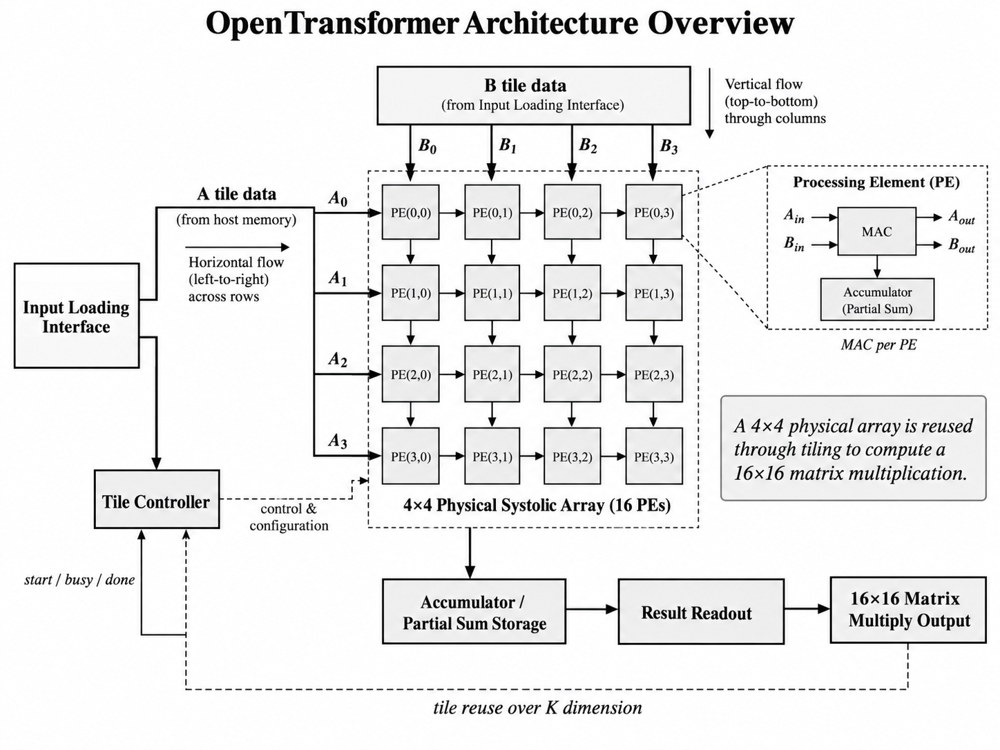
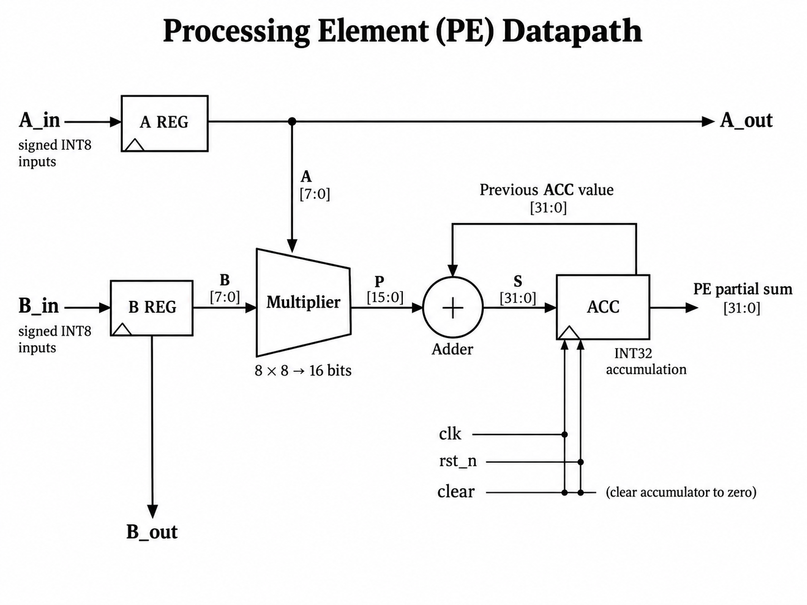
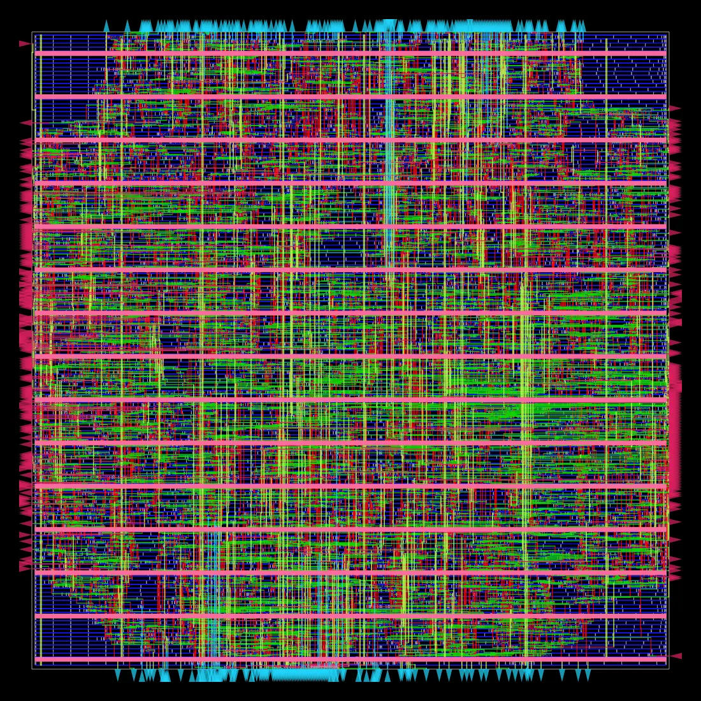

# OpenTransformer

OpenTransformer is a SystemVerilog hardware accelerator project for tiled matrix multiplication.

The completed milestone uses a **4×4 physical systolic array** with **16 processing elements** and reuses it through tiling to compute a **16×16 matrix multiplication workload**.

> The workload is 16×16, but the physical compute array is 4×4.

---

## Final Paper

- [Final IEEE-style paper PDF](paper/open_transformer_ieee.pdf)
- [LaTeX source](paper/open_transformer_ieee.tex)

---

## Previews

### Architecture



### Processing Element Datapath



### OpenROAD Routed Layout



The layout image is from the completed OpenROAD physical-design flow for the `pe_array_4x4` compute core.

---

## Final Milestone Summary

| Area | Result |
|---|---|
| RTL design | Complete |
| Physical compute array | 4×4 systolic array |
| Processing elements | 16 |
| Matrix workload | 16×16 |
| Simulation | 256 / 256 outputs correct |
| Lint | Passed |
| Yosys synthesis | Passed |
| FPGA target | Tang Nano 9K |
| FPGA artifacts | Generated |
| OpenROAD target | Nangate45 |
| OpenROAD completed block | `pe_array_4x4` |
| Final routed layout | Generated |
| Final GDS | Generated |
| Final paper | 7-page IEEE-style PDF |

---

## Main RTL Files

| File | Purpose |
|---|---|
| `rtl/mac.sv` | Multiply-accumulate unit |
| `rtl/pe.sv` | Processing element |
| `rtl/pe_array_4x4.sv` | 4×4 physical systolic array |
| `rtl/tile_controller.sv` | Tile sequencing controller |
| `rtl/matmul_16x16.sv` | Tiled 16×16 matrix multiply top |
| `rtl/fpga_top.sv` | Tang Nano 9K FPGA wrapper |

Main testbench:

- `tb/tb_matmul_16x16.sv`

---

## Verification Result

The final top-level simulation verified the complete tiled 16×16 matrix multiplication design.

```text
16x16 MATRIX MULTIPLY TEST PASS
All 256 outputs correct
```

Evidence:

- [Final simulation log](reports/final/final_sim_16x16.log)
- [Final lint log](reports/final/final_lint.log)
- [Final Yosys synthesis log](reports/final/final_yosys_synth.log)

---

## FPGA Evidence

The design produced Tang Nano 9K FPGA artifacts.

| Resource Group | Count |
|---|---:|
| LUT group | 4,703 |
| DFF group | 843 |
| RAM16SDP4 | 168 |
| MULT9X9 | 16 |
| IO | 4 |

Evidence:

- [FPGA summary](reports/final/final_fpga_summary.md)
- [FPGA bitstream](reports/final/opent_final.fs)
- [FPGA synthesis JSON](reports/final/opent_synth_final.json)
- [FPGA PNR JSON](reports/final/opent_pnr_final.json)
- [FPGA hashes](reports/final/final_fpga_hashes.txt)

---

## OpenROAD Physical Design

The completed OpenROAD result is for the **4×4 PE-array compute core**, `pe_array_4x4`.

The full `matmul_16x16` top-level OpenROAD run was attempted and documented, but it did not complete the full route/signoff flow. The completed routed/GDS result is for the compute core.

### Final OpenROAD Results

| Metric | Result |
|---|---:|
| Platform | Nangate45 |
| Clock target | 10 ns |
| Final design area | 14,764 µm² |
| Final utilization | 31% |
| Detail-route violations | 0 |
| Antenna net violations | 0 |
| Antenna pin violations | 0 |
| Total routed wire length | 113,082 µm |
| Total vias | 52,211 |
| Final GDS generated | Yes |

Evidence:

- [OpenROAD summary](reports/openroad/pe_array_final/OPENROAD_SUMMARY.md)
- [Final GDS](reports/openroad/pe_array_final/results/6_final.gds)
- [Final DEF](reports/openroad/pe_array_final/results/6_final.def)
- [Final ODB](reports/openroad/pe_array_final/results/6_final.odb)
- [OpenROAD hashes](reports/openroad/pe_array_final/SHA256SUMS.txt)
- [OpenROAD reports](reports/openroad/pe_array_final/reports/)
- [OpenROAD logs](reports/openroad/pe_array_final/logs/)

Partial full-top OpenROAD evidence:

- [Full top-level partial OpenROAD README](reports/openroad/full_top_partial/README.md)
- [Full top-level CTS crash log](reports/openroad/full_top_partial/matmul_16x16_openroad_cts_crash.log)

---

## Repository Map

| Folder | Contents |
|---|---|
| `rtl/` | SystemVerilog RTL |
| `tb/` | Testbenches |
| `sim/` | Simulation/build support |
| `fpga/` | FPGA constraints and board files |
| `reports/final/` | Final simulation, lint, synthesis, and FPGA evidence |
| `reports/openroad/` | OpenROAD physical-design evidence |
| `paper/` | Final paper, figures, and PDF |
| `notes/` | Development log |

---

## Project Status

OpenTransformer is a finished documented milestone.

It demonstrates a tiled matrix-multiply accelerator built from a reusable 4×4 systolic array, verified at the RTL level, mapped to FPGA artifacts, and physically implemented through OpenROAD for the PE-array compute core.