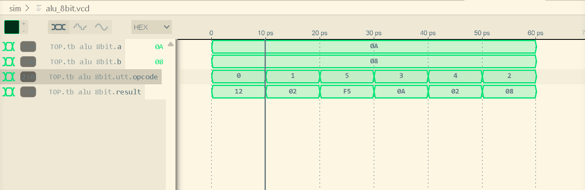

# Dev Log - Jul 4, 2026

## Progress Update

### Week 1: Toolchain Setup & AND Gate Verification

**Goal:** Set up a working WSL2/Codespaces development environment and verify the simulation flow by building a simple AND gate.

**Studied:**
- Nand2Tetris
- HDLBits (Verilog Basics, Vectors, Modules)
  
### What I Learned
- [x] Set up an Ubuntu 22.04 development environment in WSL2/Codespaces.
- [x] Installed and verified Verilator, Yosys, and GTKWave.
- [x] Learned how Nand2Tetris CHIP definitions translate into SystemVerilog modules.
- [x] Wrote my first SystemVerilog testbench and understood how it drives inputs into a design.

### Tasks Completed
- [x] Created a synthesizable `and_gate.sv` module.
- [x] Wrote `tb_and_gate.sv` to verify all four AND gate input combinations.
- [x] Built a simple Makefile to compile and simulate the design with Verilator.

**Files Updated**
- `rtl/and_gate.sv`
- `tb/tb_and_gate.sv`
- `sim/Makefile`

**Commit**
```text
feat: establish development toolchain and verify basic AND gate
```

---

# Dev Log - Jul 5, 2026

## Progress Update

### Week 1 Continued: 8-Bit ALU & SystemVerilog Packages

**Goal:** Build an 8-bit ALU, organize reusable types with SystemVerilog packages, and resolve compiler warnings while learning more about Verilator.

**Studied:**
- SystemVerilog Packages
- Enums
- Case Statements
- HDLBits: Procedures and More Verilog Features

### What I Learned
- [x] How packages help organize reusable types like enums.
- [x] Why type scoping (`package::type`) matters during compilation.
- [x] Why importing packages inside modules avoids `$unit` namespace warnings.
- [x] Why combinational `case` statements should include a `default` branch.

### Tasks Completed
- [x] Created `alu_pkg.sv` to store the `alu_op_e` enum.
- [x] Built an 8-bit combinational ALU supporting:
  - ADD
  - SUB
  - AND
  - OR
  - XOR
  - NOT
- [x] Wrote a SystemVerilog testbench to verify each ALU operation.
- [x] Added a `default` case to eliminate `CASEINCOMPLETE` warnings.
- [x] Used the WaveTrace VS Code extension to view waveform files since GTKWave could not run inside Codespaces.

**Files Updated**
- `rtl/alu_pkg.sv`
- `rtl/alu_8bit.sv`
- `sim/tb_alu_8bit.sv`
- `sim/Makefile`

**Commit**
```text
fix: resolve package type issues and verify 8-bit ALU simulation
```

---

# Problems I Ran Into

### Package Type Error

**Error**
```text
Cannot find file containing interface: 'alu_op_e'
```

**Cause**

Verilator parsed the module ports before it knew what `alu_op_e` was, so it treated the enum as an unknown interface.

**Solution**

Referenced the enum directly in the port list:

```systemverilog
input alu_pkg::alu_op_e opcode
```

---

### Package Import Warning

**Warning**
```text
%Warning-IMPORTSTAR
```

**Cause**

I originally imported the package at `$unit` scope.

**Solution**

Moved the import statement inside the module to keep the namespace clean.

---

### Incomplete Case Statement

**Warning**
```text
%Warning-CASEINCOMPLETE
```

**Cause**

My enum only defined operations 0–5, but a 3-bit opcode can represent values 0–7.

**Solution**

Added:

```systemverilog
default: result = 8'b0;
```

This guarantees every possible opcode has a defined output.

---

### GTKWave in Codespaces

**Error**
```text
Could not initialize GTK! Is DISPLAY env var/xhost set?
```

**Cause**

Codespaces runs in a headless Linux environment without a graphical desktop.

**Solution**

Used the WaveTrace VS Code extension to inspect the generated `.vcd` waveform instead.

---

# Verification Results

## ALU Test Output

```text
Time |  A | B | opcode | result
--------------------------------
10   | 10 | 8 |   0    | 18
20   | 10 | 8 |   1    | 2
30   | 10 | 8 |   5    | 245
40   | 10 | 8 |   3    | 10
50   | 10 | 8 |   4    | 2
60   | 10 | 8 |   2    | 8
```

## Expected Results

| Opcode | Operation | Expected Result |
|--------:|-----------|----------------:|
| 0 | ADD | 18 |
| 1 | SUB | 2 |
| 2 | AND | 8 |
| 3 | OR | 10 |
| 4 | XOR | 2 |
| 5 | NOT | 245 |

The simulation output matched the expected results for every ALU operation.

## Waveform



---

## Reflection

This project helped me become more comfortable with organizing SystemVerilog projects, writing reusable packages, and debugging Verilator warnings. I also learned that compiler warnings usually point to good design practices rather than just errors to silence. Building the ALU was a good step up from the simple AND gate and gave me more confidence working with combinational logic and simulation.

# Dev Log - Jul 13, 2026

## Progress Update

### Week 2: 16×8-bit Register File & Git Sync

**Goal:** Build a 16×8-bit register file for the processor datapath and resolve a diverged Git branch before continuing development.

**Studied:**
- Sequential vs. Combinational Logic
- Non-blocking assignments (`<=`)
- Continuous assignments (`assign`)
- Active-low asynchronous resets (`negedge rst_n`)
- Git rebasing and branch synchronization

### What I Learned

- [x] How `assign` creates combinational logic for reading register values without waiting for a clock edge.
- [x] Why `always_ff @(posedge clk)` is used for synchronous writes.
- [x] Why non-blocking assignments (`<=`) are used in sequential logic.
- [x] How to reset every register using a loop during an asynchronous reset.
- [x] How `git pull --rebase` keeps commit history clean when local and remote branches diverge.

### Tasks Completed

- [x] Built a 16×8-bit register file with:
  - Two independent read ports (`r_data_a`, `r_data_b`)
  - One write port with a write enable (`w_en`)
  - Active-low asynchronous reset (`rst_n`)
- [x] Added the module as `rtl/reg_file.sv`.
- [x] Synced my local branch with the remote repository using Git rebase.

**Files Updated**
- `rtl/reg_file.sv`

**Commit**
```text
feat: implement 16x8 register file and sync repository
```

---

## Problem I Ran Into

### Git Branch Divergence

**Issue**

Git reported that my local and remote branches had diverged.

**Cause**

Both branches contained commits that the other didn't have.

**Solution**

Used:

```bash
git pull --rebase
```

This replayed my local commits on top of the latest changes from `main`, allowing me to push without creating an unnecessary merge commit.

---

## Next Steps

- Write a SystemVerilog testbench for the register file.
- Verify reset behavior and write-enable logic.
- Test simultaneous reads from both output ports.