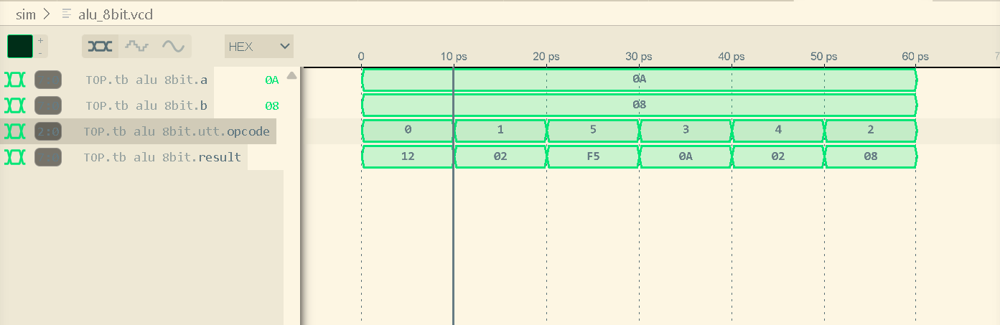
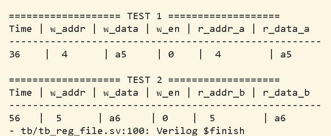
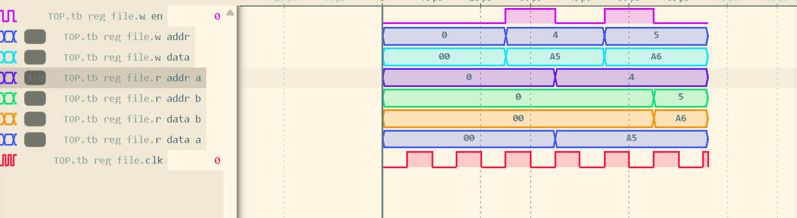
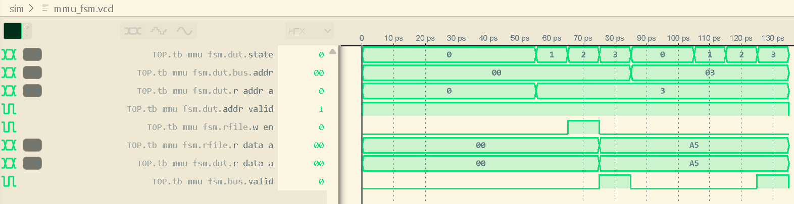

# Dev Log - Jul 4, 2026

## Progress Update

### Week 1: Toolchain Setup & AND Gate Verification

**Goal:** Set up a working WSL2/Codespaces development environment and verify the simulation flow by building a simple AND gate.

**Studied:**
- Nand2Tetris
- HDLBits (Verilog Basics, Vectors, Modules)
  
### What I Learned
- [x] Set up an Ubuntu 22.04 development environment in WSL2/Codespaces.
- [x] Installed and verified Verilator, Yosys, and GTKWave.
- [x] Learned how Nand2Tetris CHIP definitions translate into SystemVerilog modules.
- [x] Wrote my first SystemVerilog testbench and understood how it drives inputs into a design.

### Tasks Completed
- [x] Created a synthesizable `and_gate.sv` module.
- [x] Wrote `tb_and_gate.sv` to verify all four AND gate input combinations.
- [x] Built a simple Makefile to compile and simulate the design with Verilator.

**Files Updated**
- `rtl/and_gate.sv`
- `tb/tb_and_gate.sv`
- `sim/Makefile`

**Commit**
```text
feat: establish development toolchain and verify basic AND gate
```

---

# Dev Log - Jul 5, 2026

## Progress Update

### Week 1 Continued: 8-Bit ALU & SystemVerilog Packages

**Goal:** Build an 8-bit ALU, organize reusable types with SystemVerilog packages, and resolve compiler warnings while learning more about Verilator.

**Studied:**
- SystemVerilog Packages
- Enums
- Case Statements
- HDLBits: Procedures and More Verilog Features

### What I Learned
- [x] How packages help organize reusable types like enums.
- [x] Why type scoping (`package::type`) matters during compilation.
- [x] Why importing packages inside modules avoids `$unit` namespace warnings.
- [x] Why combinational `case` statements should include a `default` branch.

### Tasks Completed
- [x] Created `alu_pkg.sv` to store the `alu_op_e` enum.
- [x] Built an 8-bit combinational ALU supporting:
  - ADD
  - SUB
  - AND
  - OR
  - XOR
  - NOT
- [x] Wrote a SystemVerilog testbench to verify each ALU operation.
- [x] Added a `default` case to eliminate `CASEINCOMPLETE` warnings.
- [x] Used the WaveTrace VS Code extension to view waveform files since GTKWave could not run inside Codespaces.

**Files Updated**
- `rtl/alu_pkg.sv`
- `rtl/alu_8bit.sv`
- `sim/tb_alu_8bit.sv`
- `sim/Makefile`

**Commit**
```text
fix: resolve package type issues and verify 8-bit ALU simulation
```

---

# Problems I Ran Into

### Package Type Error

**Error**
```text
Cannot find file containing interface: 'alu_op_e'
```

**Cause**

Verilator parsed the module ports before it knew what `alu_op_e` was, so it treated the enum as an unknown interface.

**Solution**

Referenced the enum directly in the port list:

```systemverilog
input alu_pkg::alu_op_e opcode
```

---

### Package Import Warning

**Warning**
```text
%Warning-IMPORTSTAR
```

**Cause**

I originally imported the package at `$unit` scope.

**Solution**

Moved the import statement inside the module to keep the namespace clean.

---

### Incomplete Case Statement

**Warning**
```text
%Warning-CASEINCOMPLETE
```

**Cause**

My enum only defined operations 0–5, but a 3-bit opcode can represent values 0–7.

**Solution**

Added:

```systemverilog
default: result = 8'b0;
```

This guarantees every possible opcode has a defined output.

---

### GTKWave in Codespaces

**Error**
```text
Could not initialize GTK! Is DISPLAY env var/xhost set?
```

**Cause**

Codespaces runs in a headless Linux environment without a graphical desktop.

**Solution**

Used the WaveTrace VS Code extension to inspect the generated `.vcd` waveform instead.

---

# Verification Results

## ALU Test Output

```text
Time |  A | B | opcode | result
--------------------------------
10   | 10 | 8 |   0    | 18
20   | 10 | 8 |   1    | 2
30   | 10 | 8 |   5    | 245
40   | 10 | 8 |   3    | 10
50   | 10 | 8 |   4    | 2
60   | 10 | 8 |   2    | 8
```

## Expected Results

| Opcode | Operation | Expected Result |
|--------:|-----------|----------------:|
| 0 | ADD | 18 |
| 1 | SUB | 2 |
| 2 | AND | 8 |
| 3 | OR | 10 |
| 4 | XOR | 2 |
| 5 | NOT | 245 |

The simulation output matched the expected results for every ALU operation.

## Waveform



---

## Reflection

This project helped me become more comfortable with organizing SystemVerilog projects, writing reusable packages, and debugging Verilator warnings. I also learned that compiler warnings usually point to good design practices rather than just errors to silence. Building the ALU was a good step up from the simple AND gate and gave me more confidence working with combinational logic and simulation.

# Dev Log - Jul 13, 2026

## Progress Update

### Week 2: 16×8-bit Register File & Git Sync

**Goal:** Build a 16×8-bit register file for the processor datapath and resolve a diverged Git branch before continuing development.

**Studied:**
- Sequential vs. Combinational Logic
- Non-blocking assignments (`<=`)
- Continuous assignments (`assign`)
- Active-low asynchronous resets (`negedge rst_n`)
- Git rebasing and branch synchronization

### What I Learned

- [x] How `assign` creates combinational logic for reading register values without waiting for a clock edge.
- [x] Why `always_ff @(posedge clk)` is used for synchronous writes.
- [x] Why non-blocking assignments (`<=`) are used in sequential logic.
- [x] How to reset every register using a loop during an asynchronous reset.
- [x] How `git pull --rebase` keeps commit history clean when local and remote branches diverge.

### Tasks Completed

- [x] Built a 16×8-bit register file with:
  - Two independent read ports (`r_data_a`, `r_data_b`)
  - One write port with a write enable (`w_en`)
  - Active-low asynchronous reset (`rst_n`)
- [x] Added the module as `rtl/reg_file.sv`.
- [x] Synced my local branch with the remote repository using Git rebase.

**Files Updated**
- `rtl/reg_file.sv`

**Commit**
```text
feat: implement 16x8 register file and sync repository
```

---

## Problem I Ran Into

### Git Branch Divergence

**Issue**

Git reported that my local and remote branches had diverged.

**Cause**

Both branches contained commits that the other didn't have.

**Solution**

Used:

```bash
git pull --rebase
```

This replayed my local commits on top of the latest changes from `main`, allowing me to push without creating an unnecessary merge commit.

---

## Next Steps

- Write a SystemVerilog testbench for the register file.
- Verify reset behavior and write-enable logic.
- Test simultaneous reads from both output ports.

# Dev Log - Jul 19, 2026

## Progress Update

### Week 2: Register File Verification

**Goal:** Verify the 16×8-bit register file in simulation, fix any testbench issues, and confirm the design with waveform analysis.

**Studied:**
- Testbench timing
- Reset sequencing
- Verilator waveform tracing
- Multi-port register file verification

---

## Tasks Completed

### Testbench Improvements

- [x] Added an active-low reset sequence (`rst_n = 0`) at the beginning of the simulation to initialize all registers.
- [x] Updated the testbench to wait for the positive clock edge before checking outputs.
- [x] Eliminated race conditions between write operations and data reads.

### Simulation & Debugging

- [x] Built and simulated the design with Verilator trace support.
- [x] Generated a `reg_file.vcd` waveform file.
- [x] Used WaveTrace to inspect the main register file signals.
- [x] Verified correct operation of both read ports after write operations.

---

## Files Updated

- `tb/tb_reg_file.sv`

---

## Commit

```text
test: verify register file simulation and fix testbench timing
```

---

## Problems I Ran Into

### Registers Were Not Initializing

**Issue**

The register file started with unknown (`X`) values during simulation.

**Cause**

The reset signal wasn't being asserted before the first clock cycles.

**Solution**

Added an active-low reset sequence at the start of the testbench before running any test cases.

---

### Race Conditions

**Issue**

The testbench occasionally checked the outputs before the write operation had completed.

**Cause**

The write and read operations were occurring in the same simulation cycle.

**Solution**

Waited for the next positive clock edge (`@(posedge clk)`) before checking the register values.

---

## Verification Results

### Console Output

```text
=================== TEST 1 ===================
Time | w_addr | w_data | w_en | r_addr_a | r_data_a
-----------------------------------------------------
36   | 4      | a5     | 0    | 4        | a5

=================== TEST 2 ===================
Time | w_addr | w_data | w_en | r_addr_b | r_data_b
-----------------------------------------------------
56   | 5      | a6     | 0    | 5        | a6

- tb/tb_reg_file.sv:100: Verilog $finish
```

### Expected Results

| Test | Operation | Expected | Result |
|------|-----------|----------|--------|
| 1 | Write `0xA5` to register 4 and read from Port A | `0xA5` | ✅ Pass |
| 2 | Write `0xA6` to register 5 and read from Port B | `0xA6` | ✅ Pass |

The simulation matched the expected results for both test cases.

---

## Waveform Analysis

The waveform confirmed that:

- Register writes occurred only on the positive clock edge.
- Both read ports returned the correct stored values.
- The reset cleared all registers before testing began.
- No unexpected timing issues or glitches were observed.

### Console Output



### Waveform



---

## Reflection

This was my first time building and testing a sequential hardware module with multiple read ports. I spent more time debugging the testbench than the register file itself, which helped me better understand reset timing, clocked logic, and waveform debugging. With the register file verified, I'm ready to move on to the next stage of the OpenTransformer datapath.


# Dev Log - August 2, 2026

## Progress Update

### Week 1: Control Logic & OOP Verification Setup

**Goal:** Build the MMU (memory-mapped interface controller) that manages access to the register file and verify it using a class-based SystemVerilog testbench.

**Studied:**
- SystemVerilog `interface` and `modport`
- Finite State Machine (FSM) design
- Class-based verification (`Transaction` and `Driver`)
- Blocking (`=`) vs. non-blocking (`<=`) assignments

---

## What I Learned

- [x] SystemVerilog interfaces keep related signals organized and make module connections much cleaner.
- [x] Separating sequential logic (`always_ff`) from combinational logic (`always_comb`) makes FSMs easier to understand and debug.
- [x] Mixing blocking (`=`) and non-blocking (`<=`) assignments on the same signal causes synthesis and simulation issues.
- [x] Class-based testbenches take more setup but are much easier to expand than procedural testbenches.

---

## Tasks Completed

- [x] Created `mmu_interface.sv` with a `ready` / `valid` / `error` handshake between the host and MMU.
- [x] Designed a 4-state FSM (`IDLE → DECODE → ACCESS → DONE`) to control register file accesses.
- [x] Built a class-based testbench using `Transaction` and `Driver` classes.
- [x] Verified successful write and readback operations using a register-file stub.
- [x] Updated `dailylog.md` with this week's progress, debugging notes, and verification results.
- [x] Committed and pushed all changes to GitHub.

---

## Files Updated

- `rtl/mmu_pkg.sv`
- `rtl/mmu_interface.sv`
- `rtl/mmu_fsm.sv`
- `tb/tb_mmu_fsm.sv`
- `dailylog.md`

---

## Commit

```text
feat: add MMU interface, control FSM, and class-based testbench
```

---

## Problems I Ran Into

### Blocking vs. Non-Blocking Assignment Conflict

**Issue**

```text
%Error-BLKANDNBLK: rtl/mmu_fsm.sv:18:9: Unsupported: Blocked and non-blocking
assignments to same variable: 'tb_mmu_fsm.dut.error_r'
```

**Cause**

I accidentally assigned `error_r` using both blocking (`=`) and non-blocking (`<=`). Verilator correctly flagged this because a signal should only be driven one way.

**Solution**

I moved all updates to `error_r` into the sequential `always_ff` block and created a separate combinational signal (`addr_valid`) for the address check.

---

### Read Data Always Returned Zero

**Issue**

The write operation completed successfully, but every read returned `0`.

**Cause**

`bus.rdata` was being reset to `'0'` inside `always_comb` every cycle. By the time the FSM reached the `DONE` state, the read data had already been overwritten.

**Solution**

I added a registered signal (`rdata_r`) that stores the read data during the `ACCESS` state and keeps it valid until the transaction finishes.

---

## Verification Results

```text
t=85  addr=3 write=1 rdata=0  valid=1 error=0
t=135 addr=3 write=0 rdata=a5 valid=1 error=0
```

### Verification Summary

| Test | Expected | Result |
|------|----------|--------|
| Write `0xA5` to register 3 | Write succeeds | ✅ Pass |
| Read register 3 | `0xA5` | ✅ Pass |
| Handshake signals | `valid=1`, `error=0` | ✅ Pass |

The write completed successfully, and the value `0xA5` was read back correctly from register 3.

---

## Reflection

This week felt like a step up in complexity compared to the previous modules. The FSM itself wasn't the hardest part—the real challenge was debugging timing issues and understanding why signals behaved differently across clock cycles.

The readback bug took the longest to figure out. At first, I thought something was wrong with the register file, but tracing the signals showed the data was being cleared before the transaction finished. Fixing that helped me better understand the difference between combinational and sequential logic.

I also wrote my first class-based SystemVerilog testbench. It required more setup than a procedural testbench, but I can already see how much easier it will be to extend as OpenTransformer grows.

After everything was working, I updated the documentation, committed the changes, and pushed the latest version to GitHub.

---

## Next Steps

- Add verification for invalid addresses and error handling.
- Expand the class-based testbench with additional randomized transactions.
- Begin Week 2 by implementing the UART core and AXI-Lite register interface.


# August 17, 2026 --- Parameterized MAC Unit

### Goal

Started the compute-engine stage of OpenTransformer by designing and
verifying a parameterized Multiply-Accumulate (MAC) unit.

The MAC performs:

`acc = acc + (a * b)`

This will become the main arithmetic building block for the
processing-element (PE) array and matrix-multiplication accelerator.

### RTL Design

Created `rtl/mac.sv`.

The MAC includes: - Parameterized `DATA_WIDTH` (default: 8 bits) -
Parameterized `ACC_WIDTH` (default: 32 bits) - Active-low asynchronous
reset (`rst_n`) - `clear` control to reset the accumulator - `enable`
control to perform or pause accumulation - Sequential accumulator using
`always_ff`

Control priority:

`Reset > Clear > Enable`

When enabled:

`acc <= acc + (a * b)`

When enable is low, the accumulator holds its previous value.

### Verification

Created `tb/tb_mac.sv` and tested the MAC using Verilator.

Tests: 1. Reset test 2. Multiply test: `4 * 3 = 12` 3. Accumulation
test: `12 + (2 * 5) = 22` 4. Clear test: accumulator returned to 0 5.
Enable/hold test

Simulation results:

``` text
RESET TEST PASS
MULTIPLY TEST PASS
ACCUMULATE TEST PASS
CLEAR TEST PASS
HOLD TEST PASS
```

All tests passed.

### Debugging / Review

Reviewed and practiced: - Module and port declarations - Bit widths such
as `[7:0]` - Parameterized widths using `[WIDTH-1:0]` - `always_ff` -
Non-blocking assignments (`<=`) - Active-low reset behavior - Testbench
clock generation - Waiting for `posedge clk` - Automatic PASS/FAIL
checks

Fixed several issues during development: - Missing `end` statements -
Incorrect parameter-list syntax - Missing control inputs - Accidentally
mixing MAC RTL and testbench code - Module-name mismatch between RTL and
testbench - Corrected the clear test to check `acc` instead of only
checking the `clear` input

### Synthesis

Synthesized `rtl/mac.sv` successfully using Yosys.

Yosys statistics:

``` text
Number of wires:             12
Number of wire bits:        181
Number of public wires:       7
Number of public wire bits:  52
Number of cells:              6

$add          1
$adffe        1
$mul          1
$mux          2
$reduce_bool  1
```

The synthesized design contains the expected MAC hardware: - 1
multiplier - 1 adder - 1 registered accumulator - Control/multiplexer
logic

### Result

The first compute block for OpenTransformer is complete.

`MAC RTL -> Verification -> Synthesis`

All stages passed successfully.

### Next Steps

-   Build a Processing Element (PE) around the MAC
-   Verify the PE independently
-   Begin connecting multiple PEs into a 2x2 matrix-multiplication array

# August 18, 2026 — Processing Element and 2×2 Systolic Array

## Goal

Continued the compute-engine stage of OpenTransformer by building a reusable Processing Element (PE) around the existing MAC and connecting four PEs into a 2×2 systolic array.

The main goals were:

- Reuse the verified parameterized MAC
- Add registered A/B forwarding for systolic data movement
- Verify PE compute, accumulation, clear, and hold behavior
- Build a 2×2 PE array
- Verify correct A-right / B-down dataflow
- Perform the first complete 2×2 matrix multiplication

---

## Processing Element Design

Created `rtl/pe.sv`.

The PE contains:

- Parameterized `DATA_WIDTH` (default: 8 bits)
- Parameterized `ACC_WIDTH` (default: 32 bits)
- Existing `mac` module instantiated internally
- `a_in` and `b_in` data inputs
- Registered `a_out` and `b_out` forwarding outputs
- Local accumulator output `acc`
- Shared `clk`, `rst_n`, `clear`, and `enable` controls

The MAC performs:

`acc <= acc + (a_in * b_in)`

while the forwarding registers perform:

`a_out <= a_in`

`b_out <= b_in`

when `enable` is high.

This allows A values to move horizontally across the future PE array while B values move vertically.

---

## PE Verification

Created `tb/tb_pe.sv`.

Verified:

- Compute + forward
- Multi-cycle accumulation
- Clear
- Enable/hold

Test sequence:

1. `a_in = 4`, `b_in = 3`
   - Expected `acc = 12`
   - Expected `a_out = 4`
   - Expected `b_out = 3`

2. `a_in = 2`, `b_in = 5`
   - Expected accumulated result: `12 + 10 = 22`

3. Asserted `clear`
   - Expected `acc = 0`

4. Disabled `enable`
   - Expected accumulator and forwarding registers to hold their previous values

Simulation output:

```text
PE COMPUTE/FORWARD TEST PASS
PE ACCUMULATE TEST PASS
PE CLEAR TEST PASS
PE HOLD TEST PASS
```

---

## PE Synthesis

Synthesized the PE using Yosys.

Design hierarchy statistics:

```text
Number of wires:                 21
Number of wire bits:            249
Number of public wires:          16
Number of public wire bits:     120
Number of memories:               0
Number of memory bits:            0
Number of processes:              0
Number of cells:                  8
  $add                            1
  $adffe                          3
  $mul                            1
  $mux                            2
  $reduce_bool                    1
```

The synthesized PE contains:

- 1 multiplier
- 1 adder
- 1 accumulator register
- 2 forwarding registers
- MAC control logic

Result: PE simulation and synthesis passed.

---

## 2×2 Systolic Array Design

Created `rtl/pe_array_2x2.sv`.

The array contains four PE instances:

```text
                 b_col0              b_col1
                    ↓                   ↓
a_row0 ──────► [ PE00 ] ──────► [ PE01 ]
                    ↓                   ↓
                    ↓                   ↓
a_row1 ──────► [ PE10 ] ──────► [ PE11 ]
```

Data movement:

- A values move right
- B values move down

Internal PE connections:

```text
PE00.a_out -> PE01.a_in
PE00.b_out -> PE10.b_in

PE10.a_out -> PE11.a_in
PE01.b_out -> PE11.b_in
```

The array exposes four accumulator outputs:

```text
acc00
acc01
acc10
acc11
```

Edge forwarding outputs are also exposed so the array can later be extended or tiled into larger structures.

---

## Array Linting

Ran Verilator lint on:

```text
rtl/mac.sv
rtl/pe.sv
rtl/pe_array_2x2.sv
```

Fixed:

- Internal signal declarations accidentally placed inside the module port list
- Duplicate `pe10` instance name
- Unused edge signals by exposing the right and bottom edge outputs
- Minor port-list syntax issues

Final Verilator lint completed cleanly.

---

## First 2×2 Matrix Multiplication

Created `tb/tb_pe_array_2x2.sv`.

Test matrices:

```text
A = [ 1  2 ]
    [ 3  4 ]

B = [ 5  6 ]
    [ 7  8 ]
```

Expected result:

```text
C = A × B

C = [ 19  22 ]
    [ 43  50 ]
```

Calculations:

```text
C00 = 1×5 + 2×7 = 19
C01 = 1×6 + 2×8 = 22
C10 = 3×5 + 4×7 = 43
C11 = 3×6 + 4×8 = 50
```

Because the design is systolic, matrix values were staggered across clock cycles so that A values moved right and B values moved down at the correct time.

Simulation output:

```text
2x2 MATRIX MULTIPLY TEST PASS
Edge outputs: a_right0=0 a_right1=4 b_bottom0=0 b_bottom1=8
2x2 ARRAY CLEAR TEST PASS
```

The array produced the correct result:

```text
[ 19  22 ]
[ 43  50 ]
```

---

## Result

Completed both the Processing Element and the first 2×2 systolic array.

Current compute hierarchy:

```text
MAC
 ↓
PE
 ↓
2×2 PE Array
 ↓
2×2 Matrix Multiplication
```

The project now has a working multi-PE compute structure capable of performing a complete matrix multiplication using systolic data movement.

---

## Next Steps

- Add more 2×2 matrix test cases
- Test zero values and additional edge cases
- Add randomized 2×2 verification
- Synthesize the complete 2×2 array
- Begin scaling the architecture toward a 4×4 PE array

## August 19, 2026 — 4×4 Systolic Array and Tiled 16×16 Matrix Multiply

### Goal

Expanded the OpenTransformer compute engine from the 2×2 systolic array to a 4×4 physical array, then built a tiling controller that allows the same hardware to perform a virtual 16×16 matrix multiplication.

### 4×4 Systolic Array

Created `rtl/pe_array_4x4.sv`.

The array contains 16 processing elements arranged as:

```text
                 B0        B1        B2        B3
                 ↓         ↓         ↓         ↓

A0 ──────────► [PE00] ─► [PE01] ─► [PE02] ─► [PE03]
                 ↓         ↓         ↓         ↓
A1 ──────────► [PE10] ─► [PE11] ─► [PE12] ─► [PE13]
                 ↓         ↓         ↓         ↓
A2 ──────────► [PE20] ─► [PE21] ─► [PE22] ─► [PE23]
                 ↓         ↓         ↓         ↓
A3 ──────────► [PE30] ─► [PE31] ─► [PE32] ─► [PE33]
```

Dataflow remains:

- A values move right.
- B values move down.
- Each PE performs multiply-accumulate operations locally.

Used nested SystemVerilog `generate` loops to instantiate and connect all 16 PEs instead of manually creating each instance.

The complete 4×4 RTL passed Verilator lint with no errors.

### 4×4 Matrix Multiply Verification

Created `tb/tb_pe_array_4x4.sv`.

Tested:

```text
A =
[  1   2   3   4 ]
[  5   6   7   8 ]
[  9  10  11  12 ]
[ 13  14  15  16 ]

B =
[ 1 0 0 0 ]
[ 0 1 0 0 ]
[ 0 0 1 0 ]
[ 0 0 0 1 ]
```

Since B is the identity matrix, the expected result was:

```text
C =
[  1   2   3   4 ]
[  5   6   7   8 ]
[  9  10  11  12 ]
[ 13  14  15  16 ]
```

Simulation result:

```text
4x4 MATRIX MULTIPLY TEST PASS

[1 2 3 4]
[5 6 7 8]
[9 10 11 12]
[13 14 15 16]

4x4 ARRAY CLEAR TEST PASS
```

### 4×4 Synthesis

Synthesized the complete array using Yosys.

Design hierarchy:

```text
4×4 array
└── 16 PEs
    └── 16 MACs
```

Synthesis results:

```text
16 multipliers
16 adders
48 register cells
32 muxes
16 reduce_bool cells
128 total cells
```

This confirmed that all 16 MAC datapaths were preserved through synthesis.

### Tile Controller

Created `rtl/tile_controller.sv`.

The controller reuses the physical 4×4 systolic array to calculate larger matrix operations.

A 16×16 matrix is divided into 4×4 tiles:

```text
[ T00 T01 T02 T03 ]
[ T10 T11 T12 T13 ]
[ T20 T21 T22 T23 ]
[ T30 T31 T32 T33 ]
```

For one output tile:

```text
C00 =
A00 × B00 +
A01 × B10 +
A02 × B20 +
A03 × B30
```

The controller tracks:

```text
tile_row
tile_col
k_tile
cycle_count
```

It sequences the systolic array through the required tile multiplications while keeping the partial products accumulated.

The tile controller passed Verilator lint cleanly.

### Virtual 16×16 Matrix Multiply

Created `rtl/matmul_16x16.sv`.

The module combines:

```text
16×16 input storage
        ↓
tile controller
        ↓
physical 4×4 systolic array
        ↓
16×16 result storage
```

The same 16 physical PEs are reused across the matrix instead of creating a physical 16×16 array.

A complete 16×16 multiply requires:

```text
16 output tiles
×
4 K-tile operations per output tile
=
64 physical 4×4 tile operations
```

### 16×16 Verification

Created `tb/tb_matmul_16x16.sv`.

Test matrices used:

```text
A[r][c] = r + c + 1
B[r][c] = 1
```

For each output row:

```text
C[r][c] = 16r + 136
```

The testbench loaded both complete 16×16 matrices, started the accelerator, waited for the tiled computation to finish, and checked every result.

Simulation result:

```text
16x16 MATRIX MULTIPLY TEST PASS
All 256 outputs correct
```

### Result

The OpenTransformer compute engine now supports a verified tiled 16×16 matrix multiplication using a physical 4×4 systolic array.

Current compute hierarchy:

```text
MAC
 ↓
PE
 ↓
2×2 systolic array
 ↓
4×4 systolic array
 ↓
tiled 16×16 matrix multiply
```

All 256 outputs from the 16×16 verification matched the expected results.

### Next Steps

- Integrate the compute engine with the FPGA target.
- Measure FPGA resource usage and timing.
- Run the matrix multiply on physical hardware.
- Collect performance results for analysis.
## August 21, 2026 — FPGA Resource Optimization

### Goal

Move the tiled 16×16 matrix-multiply engine toward the Tang Nano 9K by reducing FPGA resource usage enough for the design to fit on the device.

### Initial FPGA Synthesis

The tiled 16×16 accelerator was already working correctly in simulation, but the first FPGA implementation was far too large for the Tang Nano 9K.

Initial place-and-route attempts showed roughly:

```text
~190% LUT usage
>150% register usage
```

The design was logically correct, but it could not physically fit on the target FPGA.

### Main Problem

The biggest issue was the result memory.

The 16×16 output matrix stores 256 results, each 32 bits wide. Much of this storage was being implemented with general-purpose logic and flip-flops instead of dedicated FPGA memory.

That caused extremely high LUT and register usage.

### DSP Mapping

The synthesis toolchain was updated so the MAC multipliers could map into the Tang Nano 9K's dedicated multiplier hardware.

After the update, synthesis correctly inferred:

```text
16 MULT9X9 blocks
```

This matched the 16 physical MAC datapaths in the 4×4 systolic array.

### Result Memory Architecture Change

The original design attempted to save all 16 outputs from a completed 4×4 tile at once.

That required many parallel writes and prevented the result memory from mapping cleanly into block RAM.

The controller was changed to save the tile serially:

```text
1 result per clock
×
16 clocks
=
16 saved outputs
```

A `save_index` now tracks which accumulator value is being written.

The SAVE state lasts 16 cycles instead of one cycle.

This keeps the 4×4 compute array unchanged while making the output memory much more FPGA-friendly.

### Updated Controller Flow

```text
IDLE
  ↓
CLEAR
  ↓
RUN
  ↓
SAVE
  ↓
next tile / DONE
```

During `RUN`, the systolic array processes the required K-tile operations.

During `SAVE`, one result is written to output memory each clock.

### Block RAM Inference

The output memory was marked for block RAM inference:

```systemverilog
(* ram_style = "block" *)
logic [ACC_WIDTH-1:0] c_mem [0:255];
```

With the serial write architecture, the FPGA tools were able to map the result storage into dedicated memory.

### Final FPGA Resource Usage

After optimization, the design successfully fit on the Tang Nano 9K.

```text
LUT4:       4701 / 8640 = 54%
DFF:        1851 / 6480 = 28%
BSRAM:         1 / 26   = 3%
MULT9X9:      16 / 40   = 40%
```

Additional resources:

```text
MUX2_LUT5: 700 / 4320 = 16%
MUX2_LUT6: 254 / 2160 = 11%
MUX2_LUT7:  81 / 1080 = 7%
MUX2_LUT8:  33 / 1080 = 3%
ALU:       610 / 6480 = 9%
```

The design went from being far too large for the FPGA to fitting with substantial room remaining.

### What I Learned

This milestone showed the difference between a design that is logically correct and one that is physically implementable.

The matrix-multiply architecture worked in simulation before these changes, but the FPGA resource usage was not practical.

Changing the memory access pattern had a major effect on the implementation without changing the matrix-multiply algorithm.

The biggest lesson was that RTL structure directly affects how synthesis tools map a design into real hardware resources.

### Result

The tiled 16×16 matrix-multiply engine now fits on the Tang Nano 9K while preserving:

```text
4×4 physical systolic array
16 Processing Elements
16 hardware multipliers
tiled 16×16 matrix multiplication
```

### Next Steps

- Add the Tang Nano 9K top-level hardware interface.
- Add board pin constraints.
- Generate the FPGA bitstream.
- Program the accelerator onto the physical board.

## August 22, 2026 — Tang Nano 9K Hardware Integration

### Goal

Move OpenTransformer from an FPGA-ready design into a complete Tang Nano 9K hardware build that can be programmed onto the physical board.

### FPGA Top-Level Integration

Added a dedicated FPGA top-level module to connect the tiled 16×16 matrix-multiply engine to the Tang Nano 9K board.

The top level connects:

```text
PC
 ↓
UART
 ↓
FPGA control logic
 ↓
16×16 tiled matrix-multiply engine
```

The matrix-multiply core remains the same compute architecture:

```text
4×4 physical systolic array
16 Processing Elements
16 MAC datapaths
tiled 16×16 matrix multiplication
```

### UART Hardware Interface

Added UART receive and transmit logic inside the FPGA top-level module.

The receive path accepts bytes from the computer and loads matrix data into the accelerator.

The transmit path sends result data back toward the computer after the accelerator finishes.

The communication path uses:

```text
115200 baud
27 MHz FPGA clock
```

The UART interface is communication glue around the accelerator rather than part of the compute architecture itself.

### FPGA Control Flow

The FPGA wrapper manages the full hardware sequence:

```text
wait for packet
 ↓
load Matrix A
 ↓
load Matrix B
 ↓
start accelerator
 ↓
wait for computation
 ↓
prepare result data
 ↓
transmit results
```

Because the result memory uses synchronous reads, the controller includes a read-wait stage before latching each result for transmission.

### Tang Nano 9K Constraints

Added board constraints for:

```text
27 MHz clock
UART TX
UART RX
active-low reset
```

The design targets the Gowin GW1NR-9 device on the Tang Nano 9K.

### FPGA Bitstream Generation

Ran synthesis, place-and-route, and bitstream generation for the complete hardware design.

The resource-optimized accelerator successfully fit on the FPGA and produced a final `.fs` bitstream.

The implementation preserved the 16 dedicated hardware multipliers used by the physical 4×4 systolic array.

### Board Detection

Connected the Tang Nano 9K to the computer and verified the JTAG connection.

The FPGA was detected as:

```text
manufacturer: Gowin
family: GW1N
model: GW1N(R)-9C
```

### Programming the FPGA

Programmed the generated bitstream into the Tang Nano 9K SRAM.

Programming completed successfully:

```text
Load SRAM: 100%
Done
CRC check: Success
```

At this point, OpenTransformer was no longer only a simulation or synthesized netlist.

The accelerator was physically configured onto the FPGA.

### Result

The OpenTransformer compute engine is now integrated with the Tang Nano 9K and successfully programmed onto real FPGA hardware.

Current hardware path:

```text
Computer
 ↓
UART
 ↓
Tang Nano 9K
 ↓
OpenTransformer accelerator
```

### Next Steps

- Send complete 16×16 matrices from the computer to the FPGA.
- Receive all 256 results back from the board.
- Compare FPGA outputs against a software reference.
- Verify the complete PC → FPGA → PC path.
## August 23, 2026 — End-to-End FPGA Matrix Multiply Verification

### Goal

Verify the complete OpenTransformer hardware path by sending two full 16×16 matrices from the computer to the Tang Nano 9K, running the tiled matrix multiplication on the FPGA, receiving all 256 results back, and comparing them against a software reference.

### Host-Side Test Program

Added a small Python host program to communicate with the FPGA over UART.

The program:

```text
selects the serial port
 ↓
creates or accepts two 16×16 matrices
 ↓
sends Matrix A and Matrix B to the FPGA
 ↓
waits for the FPGA response
 ↓
receives 256 32-bit results
 ↓
computes the same matrix multiply in software
 ↓
compares every FPGA result
```

AI assistance was used for parts of the host-side Python and bring-up/debugging tooling, while the full communication path and hardware behavior were tested against the physical FPGA.

### UART Packet Flow

The computer sends:

```text
0xA5 header
256 bytes — Matrix A
256 bytes — Matrix B
```

Both input matrices are sent in row-major order using 8-bit values.

After the accelerator finishes, the FPGA sends:

```text
0x5A header
256 × 32-bit output values
```

The result values are transmitted little-endian.

### Hardware Compute Path

The matrix multiplication is performed by the FPGA accelerator:

```text
16×16 Matrix A + 16×16 Matrix B
        ↓
4×4 physical systolic array
        ↓
16 Processing Elements
        ↓
tiled hardware reuse
        ↓
16×16 Matrix C
```

The physical array contains 16 PEs, and the tile controller reuses them across the larger operation.

### Verification Test

For the first end-to-end hardware test:

```text
A[r][c] = r + c + 1
B[r][c] = 1
```

The expected output is:

```text
C[r][c] = 16r + 136
```

The host program sends both matrices to the FPGA and compares every returned value against a software matrix multiplication.

### Real FPGA Result

Verification result:

```text
PASS - all 256 outputs correct
```

Example rows:

```text
136 136 136 ... 136
152 152 152 ... 152
168 168 168 ... 168
...
376 376 376 ... 376
```

All 256 FPGA outputs matched the expected software results.

### End-to-End Timing

Measured total communication and execution time:

```text
PC → FPGA → PC: 135.14 ms
```

This includes UART transfer, FPGA control overhead, matrix computation, and host-side communication.

The 135.14 ms measurement is therefore not the accelerator-only compute latency. At 115200 baud, UART transfer dominates much of the end-to-end time.

### Full Verified Path

```text
PC
 ↓
UART
 ↓
Tang Nano 9K
 ↓
4×4 systolic array
 ↓
tiled 16×16 matrix multiplication
 ↓
result memory
 ↓
UART
 ↓
PC
 ↓
software comparison
 ↓
256 / 256 correct
```

### Result

OpenTransformer has now completed a verified 16×16 matrix multiplication on physical FPGA hardware.

The project has progressed through:

```text
MAC
 ↓
Processing Element
 ↓
2×2 systolic array
 ↓
4×4 systolic array
 ↓
tiled 16×16 matrix multiply
 ↓
FPGA implementation
 ↓
end-to-end hardware verification
```

### Next Steps

- Measure accelerator-only cycle count and compute latency.
- Calculate throughput and effective MAC performance.
- Analyze FPGA resource efficiency.
- Separate communication overhead from compute time.
- Create figures and tables from the implementation results.
- Begin the IEEE-style OpenTransformer paper.

